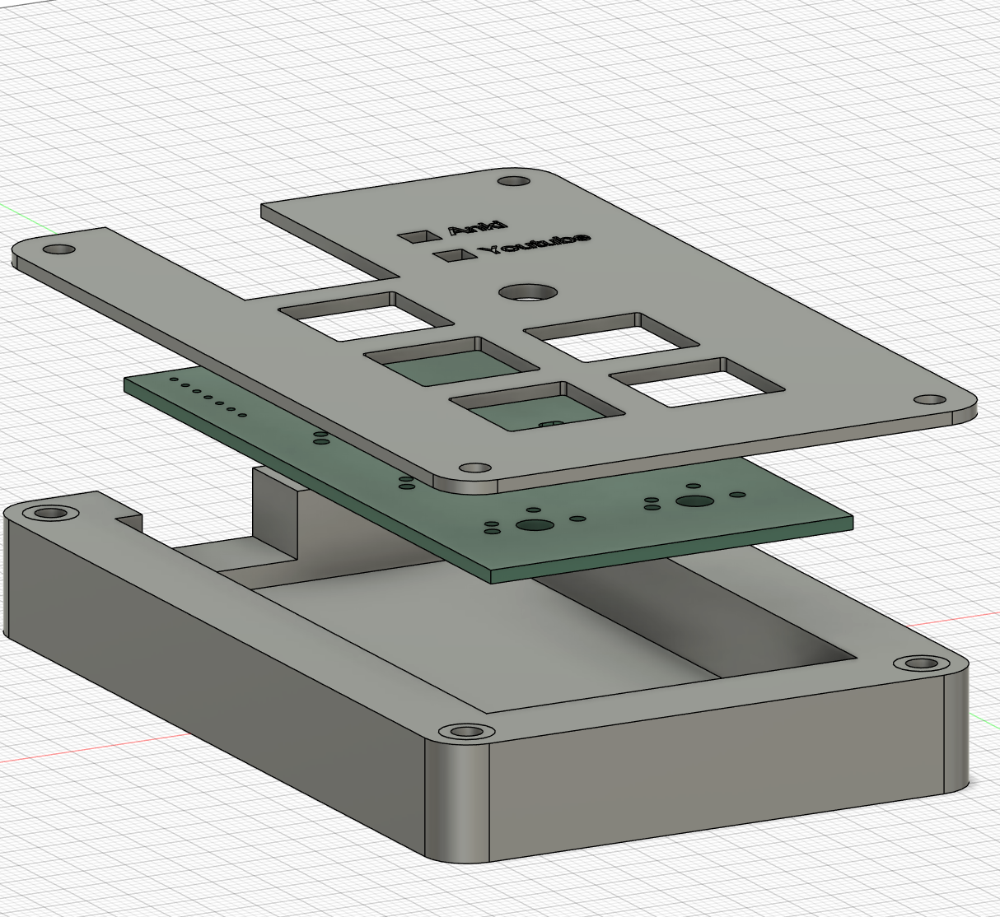
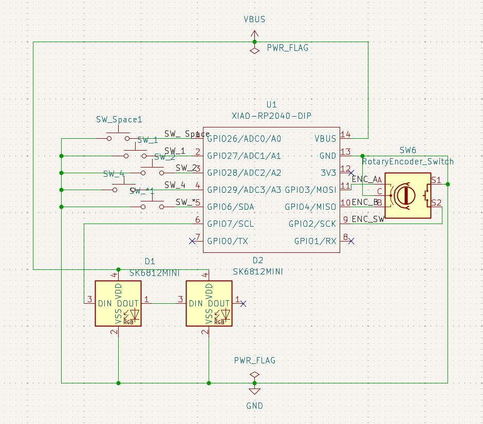
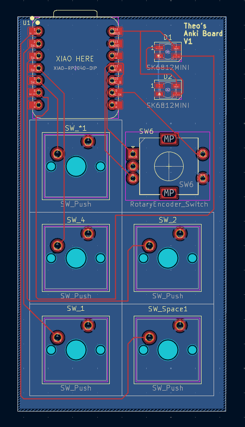
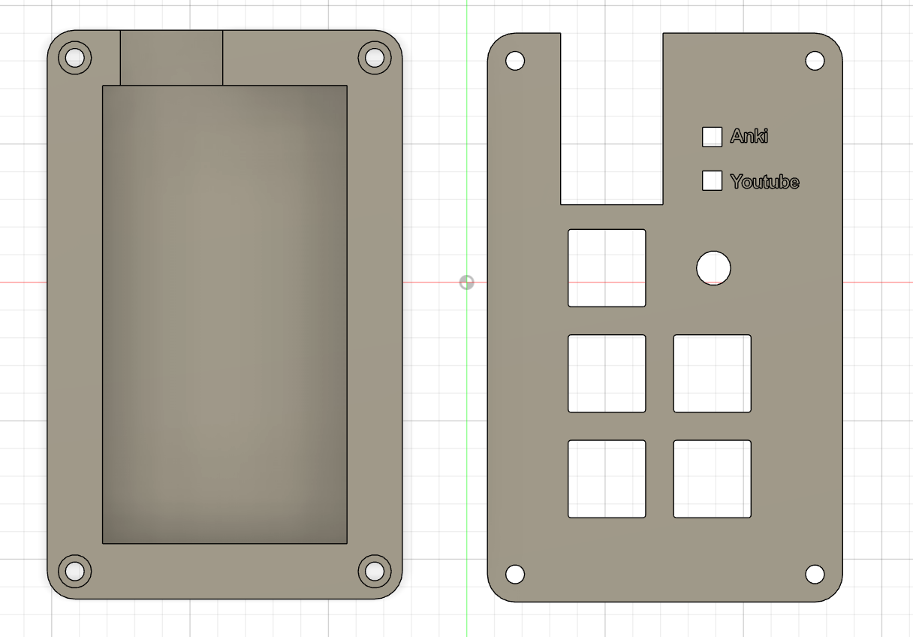

# Theo’s Study Hackpad

## Inspiration

I wanted to build a dedicated study-focused macropad to speed up my Anki revision and control YouTube without breaking focus. Instead of using keyboard shortcuts or mouse clicks, this hackpad allows for one handed control of my two most commonly used revision resources: Yotube and Anki.

## Challenges

One of the main challenges was designing a PCB that cleanly integrated mechanical switches, a rotary encoder, and addressable RGB LEDs while keeping the layout compact.

Another challenge was structuring the firmware cleanly using KMK, especially handling multiple modes (layers), encoder input, and an LED indicator

Designing the case to ensure proper alignment between the PCB, switches, encoder, and USB port also required several iterations.

## Specifications
### Modes:

Modes are switched by pressing the rotary encoder.

#### Anki Mode:

Blue LED indicator

Dedicated answer and control keys

#### YouTube Mode:

Red LED indicator

Playback and navigation controls

### BOM

1× XIAO RP2040

5× MX-style mechanical switches

5× Keycaps

1× EC11 Rotary encoder 

2× SK6812 MINI addressable RGB LEDs

Custom PCB

3D printed case (top + bottom)

USB Cable

### Firmware

KMK (CircuitPython-based firmware)

Two-layer setup (Anki / YouTube)

Encoder rotation for volume control

Encoder press for mode switching

RGB LEDs used as mode indicators

Firmware files are located in the firmware/ directory.

## Images
### Schematic

### PCB

### Case & Assembly

